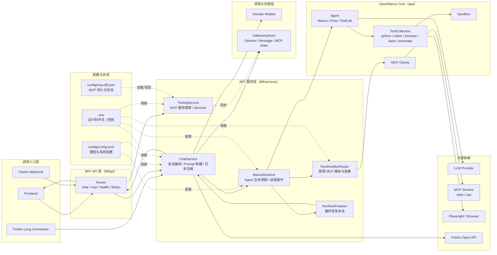
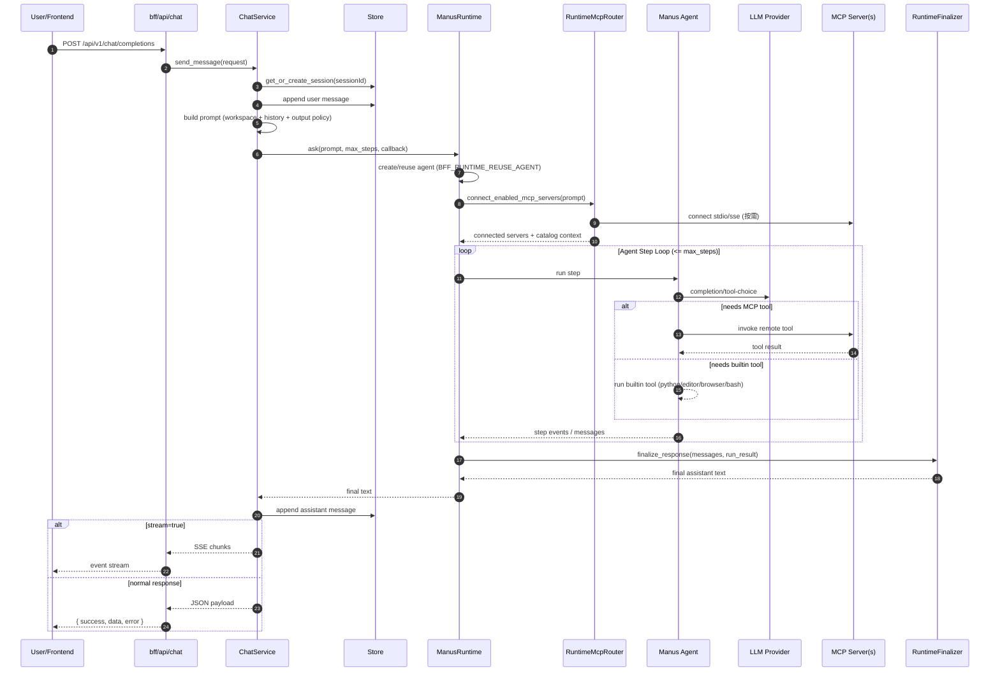
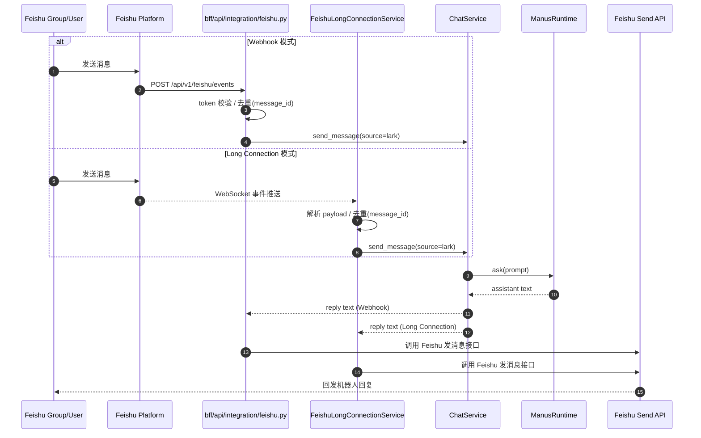
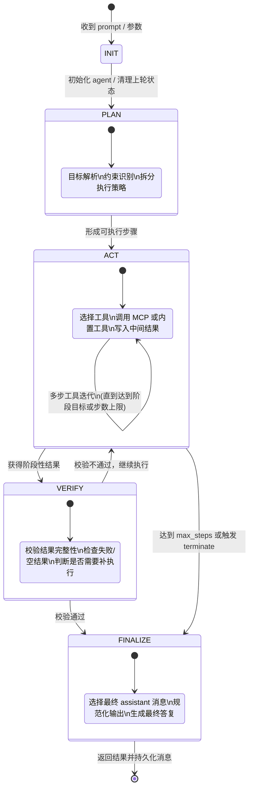

# Leo

Leo 是一个基于 **OpenManus** 演进的工程化版本，目标是在保留 OpenManus 智能体能力的基础上，补齐可接入前端、可运维、可扩展的后端运行层。

## 项目定位

- 基础能力来源：`app/` 下 OpenManus Agent、工具调用、MCP 集成能力
- 工程化增强：`bff/` 下 Leo BFF（Backend For Frontend）服务层
- 目标场景：为前端应用、飞书接入、MCP 工具编排提供稳定 API 与运行时管理

## 与 OpenManus 的关系

Leo 不是对 OpenManus 的替代，而是面向业务接入的增强层：

1. 继承 OpenManus 的智能体内核能力  
2. 新增 BFF 分层架构与统一 API  
3. 增加运行时策略（MCP 按需路由、响应收敛、会话管理）  
4. 增加工程化配置（`.env`、`config/*.toml`、`config/mcp.bff.json`）  
5. 增加飞书 Webhook/长连接集成能力

## 核心目录

```text
.
├─app/                # OpenManus 核心能力（Agent / Tool / Sandbox / Prompt）
├─bff/                # Leo 后端适配层（API / Service / Repository / Domain）
├─frontend/           # 前端项目
├─config/             # 配置模板与运行配置
├─tests/              # 自动化测试
└─README_zh.md        # 上游 OpenManus 中文说明
```

## 项目架构

Leo 采用分层架构，职责边界如下：

1. 接入层（API Layer）  
`bff/api/` 负责 HTTP 路由、请求参数校验、SSE 输出、第三方回调入口（如飞书）。

2. 服务层（Service Layer）  
`bff/services/` 负责会话管理、消息编排、运行时调度、MCP 路由、最终答复收敛。

3. 领域与存储层（Domain/Repository）  
`bff/domain/` 定义请求与会话模型，`bff/repositories/` 提供当前内存存储实现（可替换）。

4. 智能体执行层（Agent Runtime）  
`app/agent/` + `app/tool/` 提供 OpenManus 核心能力：工具调用、浏览器/文件/代码执行、MCP 客户端连接。

5. 配置与状态层（Config/State）  
`config/config.toml` 管模型与基础配置，`.env` 管运行时开关与密钥，`config/mcp.bff.json` 管 MCP 服务状态。

架构链路（详细）：



## 系统如何运作（消息回复流程）

以 `POST /api/v1/chat/completions` 为例，消息回复主流程如下：

1. 接收请求  
API 层接收用户消息，定位或创建 `session`，写入本轮 user message。

2. 构建运行时提示词  
`ChatService` 合并当前输入、工作区提示、历史上下文（按 token 预算裁剪），并应用输出策略。

3. 初始化/复用 Agent  
`ManusRuntime` 根据环境变量决定复用或新建 agent，设置最大步骤数并绑定进度回调。

4. MCP 按需连接  
`RuntimeMcpRouter` 基于当前请求语义选择需要连接的 MCP server，避免全量连接造成开销和不稳定。

5. 执行推理与工具调用  
Agent 进入 `PLAN -> ACT -> VERIFY -> FINALIZE` 阶段，按需调用本地工具或 MCP 工具完成任务。

6. 收敛最终答复  
`RuntimeFinalizer` 从消息链中选择最终 assistant 内容，做最终规范化后返回给调用方。

7. 持久化与输出  
会话消息保存到 store；若是流式请求，按 SSE 分片输出；若是飞书消息则通过飞书接口回发。

消息回复时序图（详细）：



飞书消息处理时序图（Webhook + 长连接）：



Agent 阶段状态机（PLAN / ACT / VERIFY / FINALIZE）：



补充说明：

- 默认响应结构：`{ success, data, error }`
- 流式接口：`/api/v1/chat/completions?stream=true`
- 飞书入口：`POST /api/v1/feishu/events`（Webhook）或长连接服务

## 快速开始

### 1) 安装依赖

```bash
python -m venv .venv
# Windows:
.venv\Scripts\activate
# macOS/Linux:
# source .venv/bin/activate

pip install -r requirements.txt
```

### 2) 准备配置

1. LLM 配置：复制并编辑 `config/config.toml`
2. 环境变量：编辑根目录 `.env`（飞书、BFF 运行参数等）
3. MCP 配置：按需使用 `config/mcp.bff.json`

### 3) 启动方式

- CLI（OpenManus 主入口）：
```bash
python main.py
```

- MCP 模式：
```bash
python run_mcp.py
```

- 多智能体 Flow：
```bash
python run_flow.py
```

- Leo BFF（推荐用于前端联调）：
```bash
python -m uvicorn bff.main:app --host 0.0.0.0 --port 8000
```

> Windows 下不建议使用 `--reload`，可能导致 Playwright/MCP-stdio 子进程行为异常。

## Leo BFF 能力概览

- 统一 Chat API（含流式 SSE）
- MCP Server 管理与工具发现
- 运行时路由（按请求内容选择 MCP，减少无效连接）
- 会话消息管理与历史压缩策略
- 飞书集成（Webhook + 长连接）
- 统一响应结构：`{ success, data, error }`

主要接口见：[`bff/README.md`](bff/README.md)

## 配置规范

### 配置分层

1. `config/config.toml`：模型、浏览器、sandbox、runflow 等主配置  
2. `.env`：运行时开关、飞书密钥、BFF 行为参数  
3. `config/mcp.bff.json`：MCP 服务状态与工具发现缓存

### 环境变量原则

- 布尔变量统一使用：`1/true/yes/on` 或 `0/false/no/off`
- 路径变量使用绝对路径（特别是 Windows）
- 密钥只放 `.env`，不要写入代码和提交记录

## 开发与测试

运行核心测试：

```bash
pytest tests/bff tests/sandbox -q
```

代码检查：

```bash
pre-commit run --all-files
```

## 版本说明

- 当前仓库为 OpenManus 的衍生工程化版本（Leo）
- 功能边界：保留上游能力，同时优先保证 BFF 可集成性与运行稳定性

## 致谢

- [OpenManus](https://github.com/FoundationAgents/OpenManus)
- [MetaGPT](https://github.com/geekan/MetaGPT)
- [browser-use](https://github.com/browser-use/browser-use)
- [anthropic-computer-use](https://github.com/anthropics/anthropic-quickstarts/tree/main/computer-use-demo)
