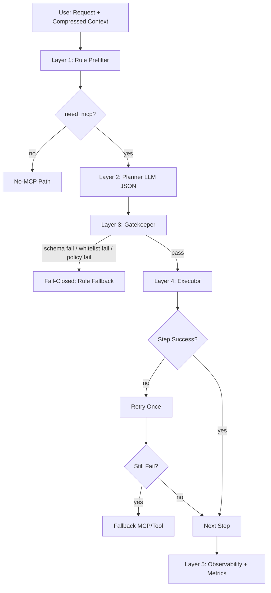
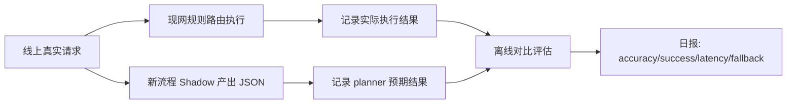
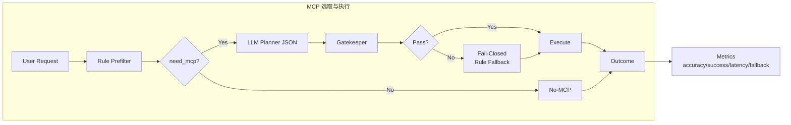

# MCP Routing V2 Design (Layered + JSON Planner)

## 1. 目标与验收

**目标**
把“是否用 MCP、用哪个 MCP、用哪个 tool”的决策从单轮猜测，升级为可控、可观测、可回滚的分层流程。

**验收指标（上线门槛）**
1. 路由准确率（Server 级）>= 95%
2. 工具首发成功率（首个 tool call 成功）>= 88%
3. 平均步骤数 <= 2.2（当前基线下降 >= 25%）
4. fallback 触发率 <= 12%

---

## 2. 方案选型（先比较，再定型）

### 方案 A：纯规则
- 优点：稳定、快、低成本
- 缺点：泛化差，混合意图易误判，维护规则成本高

### 方案 B：纯 LLM Planner
- 优点：灵活、可泛化
- 缺点：不可控，JSON 不稳定，越权风险高

### 方案 C（推荐）：规则预筛 + LLM 受限规划 + 执行闸门
- 优点：兼顾可控与泛化；LLM 只在白名单里选；支持 fail-closed
- 缺点：链路更长，需要完善日志与评估

**结论**：采用方案 C。

---

## 3. 分层流程（你要的“先 LLM 分析，再给 JSON”）



### Layer 1: Rule Prefilter（确定候选，不做最终决定）
输入：`current_request + compressed_context`

输出：
- `candidate_servers[]`
- `candidate_tools[]`
- `intent_tags[]`
- `rule_fallback`

优先级：
1. browser actions（playwright）
2. repo ops（github）
3. knowledge qa（rag）
4. search/news（trendradar/exa）

混合意图拆步示例：
- “先查抖音热点，再打开 B 站播放” -> Step1 `trendradar`, Step2 `playwright`

### Layer 2: Planner LLM（严格 JSON）
输入：用户请求 + 压缩上下文 + 候选白名单 + 协议 schema。

硬约束：
- 只能输出 JSON
- 只能从 `candidate_servers/candidate_tools` 里选
- 每步必须给 `confidence` 与 `reason`

### Layer 3: Gatekeeper（决策闸门）
顺序校验：
1. JSON schema 校验
2. 白名单校验（server/tool）
3. policy 校验（禁用/加权/风险）

任一失败：`fail-closed` 回退到规则路由。

### Layer 4: Executor（顺序执行 + 明确 done_criteria）
每步执行策略：
- 同工具重试 1 次
- 失败后走 `fallback`（MCP/tool）
- 最终返回“可解释失败”

### Layer 5: Observability
必打点：
- 规则候选
- planner 选择
- gatekeeper 结果
- 实际调用轨迹
- 成功/失败/时延

---

## 4. Planner JSON 协议草案（v1）

```json
{
  "version": "mcp-plan.v1",
  "need_mcp": true,
  "plan_steps": [
    {
      "goal": "打开 B 站并定位目标视频",
      "server_id": "playwright",
      "tool_name": "browser_navigate",
      "args_hint": {
        "url": "https://www.bilibili.com"
      },
      "confidence": 0.93,
      "reason": "用户请求明确是网页操作，属于浏览器自动化"
    }
  ],
  "fallback": {
    "mode": "rule_route",
    "server_id": "playwright",
    "tool_name": "browser_navigate",
    "reason": "planner unavailable or validation failed"
  }
}
```

### 字段要求
- `need_mcp`: `boolean`，必填
- `plan_steps`: `array`，当 `need_mcp=true` 时至少 1 条
- `plan_steps[].goal`: `string`，必填
- `plan_steps[].server_id`: `string`，必填
- `plan_steps[].tool_name`: `string`，必填
- `plan_steps[].args_hint`: `object`，必填，可为空 `{}`
- `plan_steps[].confidence`: `number`，范围 `[0,1]`
- `plan_steps[].reason`: `string`，必填
- `fallback`: `object`，必填

### 错误码（Gatekeeper）
- `E1001_INVALID_JSON`
- `E1002_SCHEMA_VIOLATION`
- `E1003_SERVER_NOT_ALLOWED`
- `E1004_TOOL_NOT_ALLOWED`
- `E1005_POLICY_BLOCKED`
- `E1006_EMPTY_PLAN_WHEN_NEED_MCP`
- `E1007_CONFIDENCE_OUT_OF_RANGE`

处理策略：任一错误 => `fail-closed` 到 `rule_fallback`。

---

## 5. 与现有代码的最小改造点

基于当前代码结构（`runtime_mcp_router.py`、`runtime_executor.py`、`runtime_policy.py`）：

1. 新增 `bff/services/runtime/runtime_prefilter.py`
- 复用 `RuntimeMcpRouter` 的意图与别名能力，产出候选白名单。

2. 新增 `bff/services/runtime/runtime_planner.py`
- 封装 Planner LLM 调用
- 注入 schema 与候选集合
- 只接受 JSON

3. 新增 `bff/services/runtime/runtime_plan_validator.py`
- schema 校验
- whitelist 校验
- policy 校验
- 输出标准错误码

4. 扩展 `bff/services/runtime/runtime_executor.py`
- 接入 `plan_steps` 顺序执行
- 每步 retry/fallback
- 落地 done_criteria

5. 扩展打点（沿用现有 `record_mcp_routing_event`）
- 新增 `event_type`: `prefilter | planner | gatekeeper | step_outcome | summary`

---

## 6. 20 条高频评测样本（人工标注）

| # | 用户请求 | 正确 MCP | 正确 tool |
|---|---|---|---|
| 1 | 打开 B 站并播放周杰伦稻香 | playwright | browser_navigate |
| 2 | 点开这个网页并截图首页 | playwright | browser_navigate/browser_take_screenshot |
| 3 | 帮我填写登录表单 | playwright | browser_fill_form |
| 4 | 搜索抖音今日热点 top5 | trendradar | get_latest_news/search_news |
| 5 | 查微博热搜并按热度排序 | trendradar | get_latest_news |
| 6 | 搜今天 AI 新闻并给出处 | exa | web_search |
| 7 | 给我 github 仓库最近 10 次提交 | github | list_commits |
| 8 | 看这个 PR 改了哪些文件 | github | get_pull_request_files |
| 9 | 创建一个 issue 标题“修复登录超时” | github | create_issue |
| 10 | 什么是 RAG？ | rag | search |
| 11 | 解释一下向量召回和重排区别 | rag | search |
| 12 | 不要知识库，直接回答什么是 agent | 无 MCP | - |
| 13 | 有哪些 MCP 工具可用？ | 无 MCP（catalog） | - |
| 14 | 先查抖音热点，再打开 B 站 | trendradar -> playwright | search_news -> browser_navigate |
| 15 | 用 github 查 open issues，再打开网页看详情 | github -> playwright | list_issues -> browser_navigate |
| 16 | 帮我检索文档并总结结论 | rag | search |
| 17 | 帮我打开 x.com 看最新动态 | playwright | browser_navigate |
| 18 | 查一下今天美元指数新闻 | exa/trendradar | web_search/search_news |
| 19 | 查看 MCP server 配置怎么写 | 无 MCP（catalog） | - |
| 20 | 打开美团并搜索汉堡店 | playwright | browser_navigate/browser_type |

> 评测时按“server 级准确率 + 首次 tool 成功率 + 步数 + fallback”联合评分。

---

## 7. Shadow 评估流程（不改代码先评审）



Shadow 阶段要求：
- 只记录，不执行 planner 结果
- 每日采样复核误差样本（至少 30 条）
- 连续 3 天达到上线门槛再灰度 10%

---

## 8. 灰度与回滚

**开关分层**
- `planner_enabled`
- `strict_json_validation`
- `multi_step_execution`

**灰度顺序**
1. shadow only
2. 10% 执行
3. 50%
4. 100%

**回滚条件（任一触发）**
- 路由准确率下降 >= 5%
- 工具首发成功率下降 >= 8%
- 平均耗时上升 >= 30%

**回滚动作**
- 立即关闭 `planner_enabled`
- 回退纯规则路由
- 保留强制重试兜底（playwright/trendradar/rag）

---

## 9. 今天可执行清单

1. 冻结 `mcp-plan.v1` 协议（本页第 4 节）
2. 把第 6 节样本落成评测集（jsonl/csv）
3. 在日志表新增 planner/gatekeeper 事件类型
4. 进行 shadow 评审会：对 20 条样本跑“规则 vs planner”离线对比

## 10. 简化流程图（便于终端和评审查看）


