# 项目工作流（竖向 Mermaid 示例）

下面这个示例使用竖向流程图（`flowchart TD`）展示从“用户提问”到“最终回复”的完整主链路，并把 MCP 的决策细节（是否使用、选哪个、何时回退）画清楚。

```mermaid
flowchart TD
    Q[用户提出一个问题] --> U[用户在前端发送消息]
    U --> API[API: POST /api/v1/chat/completions]
    API --> CS[ChatService.send_message]
    CS --> ST1[Store: 获取或创建 Session]
    ST1 --> ST2[Store: 写入 user message]
    ST2 --> BP[构建基础 Prompt<br/>输入 + Workspace + 历史 + 输出策略]
    BP --> RT[ManusRuntime.ask]
    RT --> AGI["初始化/复用 Agent<br/>Main LLM: glm-5"]

    AGI --> PRE[预编译/预构建路由上下文<br/>提取 Current User Request + Intent 线索 + MCP Catalog]
    PRE --> RT0["Retriever (SQLite + FTS + Embedding)<br/>Embedding: BAAI/bge-small-zh-v1.5 (cuda fp16)<br/>召回 candidate_servers + candidate_tools + fallback"]
    RT0 --> PEN{Planner 开启}
    PEN -->|否| RULE[走规则路由 rule_fallback<br/>server_id, tool_name]
    PEN -->|是| PL["Planner LLM 严格 JSON<br/>协议: mcp-plan.v1<br/>Planner model: glm-5"]
    PL --> GK[Gatekeeper 校验<br/>Schema, MCP 可用性, Policy]
    GK --> GOK{校验通过}
    GOK -->|否| RULE
    GOK -->|是| SHADOW{shadow_only}
    SHADOW -->|是| RULE
    SHADOW -->|否| PLAN[执行 planner plan_steps]

    RULE --> CONN1[连接 fallback server]
    PLAN --> CONN2[按 plan_steps 连接 server<br/>默认单 MCP 优先稳定]
    CONN1 --> STEPS
    CONN2 --> STEPS
    STEPS[执行步骤并检查命中<br/>未命中可 retry 或 forced fallback] --> LOOP1[Agent 循环: PLAN -> ACT -> VERIFY]

    LOOP1 --> FIN
    FIN --> AST[得到最终 assistant 文本]
    AST --> SAVE[写入 assistant message + 会话持久化]
    SAVE --> MEM[异步 Memory Sync<br/>失败仅记录日志，不阻塞主流程]
    SAVE --> OUT{stream_true}
    OUT -->|是| SSE[SSE 分片返回]
    OUT -->|否| JSON[JSON 返回]
    SSE --> END[用户收到最终回复]
    JSON --> END
```



## 当前项目模型配置（与上图对应）

截至 2026-03-16，你当前项目实际使用的模型如下：

- Main LLM（对话/执行）：`glm-5`（`config/config.toml` 的 `[llm].model`）
- Planner LLM（严格 JSON 规划）：`glm-5`（当前未配置 `[llm.planner]`，因此回退到默认）
- Tool Retrieval Embedding（工具向量召回）：`BAAI/bge-small-zh-v1.5`（`.env` 的 `BFF_MCP_TOOL_EMBEDDING_MODEL`），设备：`cuda`，dtype：`float16`
- Feishu Audio ASR（语音转文字，可选）：`faster-whisper` 模型 `small`（`.env` 的 `FEISHU_AUDIO_ASR_MODEL`），设备：`cuda`（失败自动回退 `cpu`）

对应代码与文档可参考：

- `README.md` 中的“系统如何运作（消息回复流程）”
- `docs/memory-architecture.md` 中的“Data Flow”
- `bff/services/runtime/mcp_routing/runtime_tool_index_sqlite.py`
- `bff/services/runtime/mcp_routing/runtime_tool_retriever.py`
- `bff/services/runtime/mcp_routing/runtime_planner.py`
- `bff/services/runtime/mcp_routing/runtime_plan_validator.py`
- `bff/services/runtime/runtime_executor.py`
- `bff/services/runtime/mcp_routing/runtime_mcp_router.py`

## 示例：MCP 倾向提问如何落地为最终回复

用户问题（明显偏向 MCP）：

`帮我查一下今天 AI 领域热点新闻，然后打开 B 站搜索“OpenManus”并告诉我前 3 个结果。`

这个请求会同时触发：

- `web_search` 倾向（新闻/热点）
- `browser_automation` 倾向（打开网站并操作）

Retriever（示意）会得到：

```json
{
  "intent": "browser_automation",
  "candidate_servers": ["trendradar", "playwright", "exa"],
  "candidate_tools": {
    "trendradar": ["get_latest_news", "search_news"],
    "playwright": ["browser_navigate", "browser_type", "browser_click"],
    "exa": ["search"]
  },
  "fallback": {
    "mode": "rule_route",
    "server_id": "trendradar",
    "tool_name": "get_latest_news",
    "reason": "retrieval fallback"
  }
}
```

Planner LLM 返回的 MCP 计划 JSON（示例）：

```json
{
  "need_mcp": true,
  "plan_steps": [
    {
      "goal": "获取今日 AI 热点新闻摘要",
      "server_id": "trendradar",
      "tool_name": "get_latest_news",
      "args_hint": {
        "topic": "AI",
        "limit": 5
      },
      "confidence": 0.92,
      "reason": "用户明确要求今日热点新闻"
    },
    {
      "goal": "打开 B 站并搜索 OpenManus，提取前三条结果",
      "server_id": "playwright",
      "tool_name": "browser_navigate",
      "args_hint": {
        "url": "https://www.bilibili.com"
      },
      "confidence": 0.88,
      "reason": "用户要求网页操作与结果提取"
    }
  ],
  "fallback": {
    "mode": "rule_route",
    "server_id": "trendradar",
    "tool_name": "get_latest_news",
    "reason": "任一步骤失败时使用规则回退"
  }
}
```

最终落地执行（简化）：

1. Gatekeeper 校验 JSON 结构、server/tool 白名单、策略限制。
2. `runtime_executor` 先连接 `trendradar`，执行新闻检索步骤。
3. 再连接 `playwright`，执行网页打开与搜索步骤。
4. 若某一步未命中预期工具，触发一次 `retry`；必要时走 `fallback`。
5. `RuntimeFinalizer` 收敛为一条最终 assistant 文本。
6. 若 `stream_true`，按 SSE 分片返回；否则一次性 JSON 返回。

最终回复（示例）：

`今天 AI 热点主要集中在多模态模型发布、AI Agent 工具链更新和推理成本优化三类。已在 B 站搜索 OpenManus，前 3 个结果分别是：...`
