# 项目工作流（竖向 Mermaid 示例）

下面这个示例使用竖向流程图（`flowchart TD`）展示从“用户提问”到“最终回复”的完整主链路，并把 MCP 的决策细节（是否使用、选哪个、何时回退）画清楚。

```mermaid
flowchart TD
    Q[用户提出一个问题] --> U[用户在前端发送消息]
    U --> API[API: POST /api/v1/chat/completions]
    API --> CS[ChatService.send_message]
    CS --> ST1[Store: 获取或创建 Session]
    ST1 --> ST2[Store: 写入 user message]
    ST2 --> BP[构建基础 Prompt<br/>输入 + Workspace + 历史 + 输出策略]

    BP --> RG{RAG Prefetch 开启且命中知识型问题?}
    RG -->|是| RS[RagRuntimeService.search<br/>topK/withRerank/minScore]
    RS --> RC[[Knowledge Context 注入到 Prompt<br/>source/chunk/score + 片段截断]]
    RG -->|否| SKIP[跳过 RAG Prefetch]
    RC --> RT[ManusRuntime.ask]
    SKIP --> RT

    RT --> AGI["初始化/复用 Agent<br/>Main LLM: glm-5"]
    AGI --> PRE[预编译/预构建路由上下文<br/>提取 Current User Request + Intent 线索 + MCP Catalog]
    PRE --> RT0["Retriever (SQLite + FTS + Embedding)<br/>Embedding: BAAI/bge-small-zh-v1.5 (cuda fp16)<br/>召回 candidate_servers + candidate_tools + fallback"]
    RT0 --> PEN{Planner 开启}
    PEN -->|否| RULE[走规则路由 rule_fallback<br/>server_id, tool_name]
    PEN -->|是| PL["Planner LLM 严格 JSON<br/>协议: mcp-plan.v1<br/>Planner model: glm-4.7-flashx"]
    PL --> GK[Gatekeeper 校验<br/>Schema, MCP 可用性, Policy]
    GK --> GOK{校验通过}
    GOK -->|否| RULE
    GOK -->|是| SHADOW{shadow_only}
    SHADOW -->|是| RULE
    SHADOW -->|否| PLAN[执行 planner plan_steps]

    RULE --> CONN1[连接 fallback server]
    PLAN --> CONN2[按 plan_steps 连接 server<br/>默认单 MCP 优先稳定]
    CONN1 --> STEPS
    CONN2 --> STEPS
    STEPS[执行步骤并检查命中<br/>未命中可 retry 或 forced fallback] --> LOOP1[Agent 循环: PLAN -> ACT -> VERIFY]
    LOOP1 --> FR{知识问答应触发但未触发 RAG?}
    FR -->|是| RR[强制 RAG 重试<br/>mcp_rag_search]
    FR -->|否| FIN
    RR --> FIN

    FIN --> AST[得到最终 assistant 文本]
    AST --> SAVE[写入 assistant message + 会话持久化]
    SAVE --> MEM[异步 Memory Sync<br/>失败仅记录日志，不阻塞主流程]
    SAVE --> OUT{stream_true}
    OUT -->|是| SSE[SSE 分片返回]
    OUT -->|否| JSON[JSON 返回]
    SSE --> END[用户收到最终回复]
    JSON --> END
```

## 当前项目模型配置（与上图对应）

截至 2026-03-17，你当前项目实际使用的模型如下：

- Main LLM（对话/执行）：`glm-5`（当前 active model 为 `glm-5`，与 `config/config.toml` 的 `[llm].model` 一致）
- Planner LLM（严格 JSON 规划）：`glm-4.7-flashx`（`config/config.toml` 的 `[llm.planner].model`，不再回退默认模型）
- Vision LLM（多模态/图像能力）：`glm-5`（`config/config.toml` 的 `[llm.vision].model`）
- Tool Retrieval Embedding（工具向量召回）：`BAAI/bge-small-zh-v1.5`（`.env` 的 `BFF_MCP_TOOL_EMBEDDING_MODEL`），设备：`cuda`，dtype：`float16`
- RAG Embedding（知识库向量）：`BAAI/bge-small-zh-v1.5`（`.env` 的 `RAG_EMBEDDING_MODEL`）
- Feishu Audio ASR（语音转文字，可选）：`faster-whisper` 模型 `small`（`.env` 的 `FEISHU_AUDIO_ASR_MODEL`），设备：`cuda`（失败自动回退 `cpu`）

对应代码与文档可参考：

- `README.md` 中的“系统如何运作（消息回复流程）”
- `docs/memory-architecture.md` 中的“Data Flow”
- `bff/services/runtime/mcp_routing/runtime_tool_index_sqlite.py`
- `bff/services/runtime/mcp_routing/runtime_tool_retriever.py`
- `bff/services/runtime/mcp_routing/runtime_planner.py`
- `bff/services/runtime/mcp_routing/runtime_plan_validator.py`
- `bff/services/runtime/runtime_executor.py`
- `bff/services/runtime/mcp_routing/runtime_mcp_router.py`

## 典型请求示例（含 RAG + MCP）

以下示例可直接用于验证你当前工作流：

1. 个人知识问答（RAG Prefetch 主路径）
- 用户请求：`我的工作风格是？`
- 预期：`request.rag_prefetch: injected=True`，先拼接 `[Knowledge Context]`
- 规划：通常 `need_mcp=false`（直接基于拼接上下文回答）
- 兜底：若命中异常，可触发 `mcp_rag_search`

2. 知识库约束问答（RAG Prefetch + 可选执行）
- 用户请求：`根据我的知识库，帮我写一版做事原则`
- 预期：RAG 命中你的 persona 文档片段并注入
- 规划：多数情况下无需外部 MCP；若用户要求“写入文件/发布”，才进入工具执行

3. 热点检索 + 网页操作（多 MCP 典型链路）
- 用户请求：`帮我查今天 AI 热点，再打开 B 站搜索 OpenLeo 前 3 条`
- 预期：候选服务器包含 `trendradar` 与 `playwright`
- 规划：`need_mcp=true`，按 step 顺序执行 `trendradar -> playwright`
- 失败策略：step retry，必要时回退到 rule fallback

4. GitHub 仓库运维（单 MCP 事务）
- 用户请求：`列出这个仓库最近 10 次提交并创建一个 issue`
- 预期：候选服务器优先 `github`
- 规划：`need_mcp=true`，`list_commits -> create_issue`
- 注意：Gatekeeper 校验 tool 白名单和参数结构

5. 纯闲聊或非知识依赖请求（No-MCP）
- 用户请求：`你好，今天怎么样`
- 预期：`need_mcp=false`，不连接外部 MCP，不调用 RAG
- 结果：直接模型回复，保持低延迟

## 日志观察点（排障优先）

当你排查“为什么没走 RAG/MCP”时，优先看：

- `MCP ROUTING`
- `request.rag_prefetch`：是否注入、命中条数
- `request.rag_prefetch.preview`：注入片段预览（截断）
- `intent`：是否被判为 `general / knowledge_qa / browser_automation ...`
- `execute.need_mcp`：本轮是否进入 MCP 执行
- `fallback`：失败时走了哪条兜底路径

